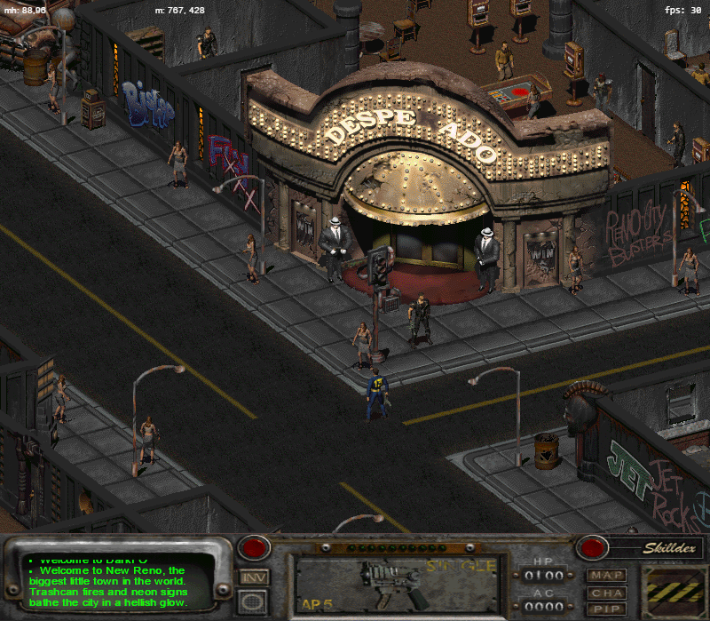

# DarkHarold2

A post-nuclear RPG remake

This is a modern reimplementation of the engine of the video game [Fallout 2](http://en.wikipedia.org/wiki/Fallout_2), as well as a personal research project into the feasibility of doing such.

The project is based on [darkfo](https://github.com/darkf/darkfo) codebase, but is modernized for Python 3, potentially
with more improvements and bug fixes coming in the future.

It is written primarily in TypeScript and Python, and targets recent browsers with WebGL 2.0 support.

## Status

DarkHarold2 is not a complete remake at this time. Estimated overall completion: **~50%**.
The core technical foundation (rendering, combat math, scripting VM, map loading, dialogue runtime) is
solid. What remains is mostly connecting gameplay systems end-to-end rather than solving hard research problems.

If you're looking for documentation on how Fallout 2 works, documentation on certain file formats, or
tools to work with them, this project will be useful to you as well.



---

### ✅ Substantially implemented (~70–90%)

- **Map loading & rendering** — tile maps, multi-elevation, WebGL 2.0 renderer, lightmap, real-time lighting
- **Walking & running** — pathfinding, door interaction, exit grids (map-to-map and worldmap transitions)
- **Combat core** — hit chance formula, ammo system (X/Y/DR/AC modifiers), burst fire (3-cone spread), called shots (8 body regions), critical hits (6 levels), critical failures (weapon-type-specific), armor DR/DT per damage type, crippled limbs, knockdown/knockout, fire DoT, ranged miss scatter, partial cover, AI weapon switching and ammo reloading, most combat perks (Slayer, Sniper, Sharpshooter, Bonus HtH Attacks, Bonus Rate of Fire, etc.)
- **Talking to NPCs** — `start_gdialog` / `giq_option` / reply callback chain, floating text messages
- **Bartering** — item exchange UI, value calculation with Barter skill modifier
- **Inventory UI** — drag-and-drop, equip slots (armor, two weapon slots), weight display, reload, stacking
- **Skill math** — all 18 skills enumerated, FO2 cost curve, tag skill doubling, trait/perk/difficulty modifiers
- **Scripting VM** — INT file parser, ~100+ opcodes dispatched, transpiler/disassembler
- **Worldmap travel** — 28×30 grid, per-tile encounter tables, time passage, area transitions
- **Random encounters** — encounter group generation, placement on encounter map
- **Audio engine** — music looping, weapon/action sound mapping, ambient SFX from map data
- **Pip-Boy** — clock display, alarm, STATUS tab, QUESTS/ARCHIVES tab, AUTOMAP tab with per-location map view, zoom/pan, IndexedDB persistence (~90% complete)
- **Character screen** — full SPECIAL/skill view, stat display, trait/perk lists
- **Save / load** — IndexedDB-backed save/load with full player state serialization: position, orientation, inventory, stats, skills, traits, perks, level/XP, equipped items, and GVARs. HUD refreshes correctly on load. Texture cache is invalidated on cross-location load, preventing missing tiles. No save slot screenshots.

---

### 🔶 Partially implemented (~30–69%)

- **Active skill use** — First Aid, Doctor, Sneak, Lockpick, Steal, Traps, Science, Repair (8 of 9 active skills; Gambling and Outdoorsman have no interactive handler). 3-use/day limit and XP awards in place. Known gaps: Healer perk not applied, Expanded Lockpick set not modelled, no electronic lockpick distinction, no facing check on Steal.
- **Level-up flow** — XP thresholds, skill point calculation (5 + 2×INT, +2 if Educated), HP per level (END/2 + 2, +4 if Lifegiver), perk every 3 levels (every 4 if Skilled). `pendingPerkPick` flag is set but **no perk selection UI exists** — picked perks never get applied.
- **Perks** — ~15 perks wired into combat and skill calculations; no rank tracking; no prerequisite checks; no selection screen.
- **Traits** — 2 of 16 traits (Gifted, Good Natured) affect skill calculations; no trait selection at character creation; no 2-trait slot limit enforced.
- **Dialogue** — runtime is functional; `giq_option`, `gsay_reply`, float messages work. `end_dialogue` is a stub in scripting. Some `gsay_message` UI integration is incomplete.
- **Character creation** — SPECIAL point-buy, tag skill selection present. Trait selection and name/age/sex entry incomplete.
- **Worldmap** — functional but rough: area entrances are misplaced on area screens, no difficulty adjustment on encounter rate, encounter items/equipping not implemented.
- **Lighting** — works but has minor inaccuracies and is slow outside the WebGL backend.
- **Time & date system** — `gametime.ts` implements ticks, day/night ambient light, script bridges for `game_time` and `game_time_hour`. `get_month` and `get_day` opcodes are hardcoded to return 1 and 0 respectively.
- **Quest system** — `questData.ts` covers all major Fallout 2 quests with GVAR-based state tracking; Pip-Boy ARCHIVES tab surfaces them. No completion rewards or XP awards wired through the engine. Quest descriptions are inlined in TS rather than loaded from `quests.msg`.
- **Animations** — FRM sprite rendering works; some animations are off, particularly related to combat.
- **Karma & reputation** — `get_pc_stat` / `mod_pc_stat` / `set_pc_stat` wired to the `Karma` and `Reputation` stats; basic +1 karma increment on player kills; STATUS panel of the character screen displays both. No karma title computation, no town reputation, no faction tracking, no proto-based karma table.

---

### ❌ Not implemented or near-absent (<30%)

- **Party / NPC followers** — `party.ts` is a 61-line shell: add/remove/enumerate only. No CHA-based party size cap, no follow/formation logic, no companion inventory access, no companion level-up, no dismissal dialogue.
- **Poison, radiation, addictions, withdrawal** — stats are defined; scripting intrinsics (`get_poison`, `radiation_dec`, `poison`) are stubs. No per-tick decay or damage loop exists anywhere in the engine.
- **Drug & chem system** — no effect timers, stat modification, or addiction rolls.
- **NPC schedules / day-night behaviour** — not implemented.
- **Perk selection UI** — `pendingPerkPick` flag is set on level-up but no screen exists to pick a perk.
- **Endgame slides / game over screen** — not implemented.
- **Subtitles / speech file playback** — audio engine has no speech hooks; no subtitle overlay.
- **DAM_DROP** (weapon drop on critical failure), unarmed hit modes (Haymaker, etc.) — not implemented in combat.
- **AI faction/team targeting** — AI selects the nearest critter regardless of team; `teamNum` is marked TODO in `object.ts`.

---

### Known scripting gaps (scripting.ts)

`~61` script intrinsics are currently stubs (log-and-return with no effect), including:
`critter_mod_skill`, `critter_injure`, `critter_is_fleeing`, `wield_obj_critter`, `critter_heal`,
`poison`, `radiation_dec`, `play_sfx`, `play_gmovie`, `mark_area_known`, `gfade_out/in`,
`reg_anim_func/animate`, `obj_art_fid`, `proto_data`, `gdialog_set_barter_mod`, and others.
`METARULE_CURRENT_TOWN`, area-known flags, and drug-influence checks are also unimplemented.

---

## Roadmap — next priorities

The goal is a playable end-to-end run. These three pieces, in order, move the needle most:

**1. Scripting stub coverage** (`scripting.ts`)
~61 script intrinsics are currently no-ops that silently log and return. This means quest scripts fail
invisibly — items don't spawn, animations don't play, characters don't react. Priority targets:
`critter_heal`, `critter_injure`, `play_sfx`, `mark_area_known`, `gfade_out/gfade_in`, `play_gmovie`.
Even rough implementations of these would unlock large chunks of scripted content.

**2. Perk selection UI** (`ui_character.ts`, `player.ts`)
The level-up math is done, `pendingPerkPick` is already set on level-up, and perks are listed in the
character screen. This just needs a selection screen wired to that flag. Low effort relative to the
visible impact on every playthrough.

---

Things deliberately left for later: party/companion system, poison/radiation/addiction loops, NPC
schedules, endgame slides. These are real gaps but not on the critical path to a believable first
playthrough.

---

## Data Pipeline

### Philosophy
The long-term goal is for the engine to own all its data in clean, typed, pre-baked JSON — no runtime parsing of original Fallout 2 file formats. Every conversion step that moves data out of `.lst`, `.pro`, `.ini`, or `.msg` files and into `lut/` is a step toward a fully self-contained engine that doesn't depend on the original file layout at runtime.

The existing `lut/` directory already follows this pattern:
- `lut/criticalTables.json` — crit tables extracted from the EXE
- `lut/elevators.json` — elevator data extracted from the EXE
- `lut/color_lut.json`, `lut/color_rgb.json` — palette data

LST files are next.

### LST → JSON pre-bake (`tools/convertLST.py`)
All Fallout 2 `.lst` files are converted to JSON arrays at setup time by `tools/convertLST.py` and written to `lut/lst/`. Each file is a plain JSON array indexed by line number, preserving exact indices.

**Naming convention:** consecutive duplicate path components are collapsed.

| Source | Output |
|---|---|
| `data/art/critters/critters.lst` | `lut/lst/art_critters.json` |
| `data/proto/critters/critters.lst` | `lut/lst/proto_critters.json` |
| `data/art/items/items.lst` | `lut/lst/art_items.json` |
| `data/art/scenery/scenery.lst` | `lut/lst/art_scenery.json` |
| `data/art/misc/misc.lst` | `lut/lst/art_misc.json` |
| `data/art/intrface/intrface.lst` | `lut/lst/art_intrface.json` |
| `data/scripts/scripts.lst` | `lut/lst/scripts.json` |

**Critical:** the converter splits on `'\n'` exactly — not `splitlines()` — to match the behaviour of `data.ts::loadLst()`. Any deviation will cause silent index drift in FRM resolution.

### Migration strategy
The runtime LST path (`data.ts::getLstId()`) is **not removed** — it stays intact as a fallback while call sites are migrated one at a time.

A parallel helper `getLstJson(lst, id)` reads from `lut/lst/` instead. Call sites in `pro.ts` are the primary migration target:

| Call site | LST | Status |
|---|---|---|
| `pro.ts::getCritterArtPath()` | `art/critters/critters` | 🔜 next |
| `pro.ts::lookupInterfaceArt()` | `art/intrface/intrface` | 🔜 next |
| `pro.ts::lookupArt()` | `art/items/items`, `art/scenery/scenery`, `art/misc/misc` | 🔜 next |
| `pro.ts::loadPRO()` | `proto/critters/critters` + 4 others | 🔜 next |
| `data.ts::lookupScriptName()` | `scripts/scripts` | later |

Skilldex and audio do **not** use LSTs and are not part of this migration.

When all call sites in a file are migrated, `getLstId()` calls in that file are removed. Once all files are migrated, `getLstId()` and `loadLst()` in `data.ts` are deleted.

## Installation

To use this, you'll need a few things:

-   A copy of Fallout 2 (already installed). You can buy one on [GOG](https://www.gog.com/en/game/fallout_2), download
    the standalone installer, and unpack on any platform supported by
    [innoextract](https://github.com/dscharrer/innoextract), or run the installer `.exe` if you're on Windows.

The rest of the dependencies can be installed all at once if you're on macOS and using [Homebrew](https://brew.sh).
Just run this command in the directory of your repository clone:

```
brew bundle
```

Otherwise you can install the dependencies manually:

-   Python 3.9 or later, earlier minor versions of Python 3 may work, but are not tested. Python 2 is not supported.

-   [Pipenv](https://github.com/pypa/pipenv) for Python dependency management.

-   The TypeScript compiler, installed via `npm install` (you'll need [node.js](https://nodejs.org/en/)).

Once you've got all that, you can start trying it out.

Open a command prompt inside the DarkHarold2 directory, and then run:

```
pipenv install
pipenv shell
python setup.py path/to/Fallout2/installation/directory
```

This will take a few minutes, it's unpacking the game archives and converting relevant game data into a format DarkHarold2 can use.

You'll need an HTTP server to run (despite being all static content) due to the way browsers sandbox requests.
If you're comfortable with setting up nginx, lighttpd, or Apache, go for that. If not, a simple way is to use Python:

-   Python 3: `python -m http.server`

Then run `npx tsc` after you've run `npm install` to compile the source code.

Browse to `http://localhost/play.html?artemple` (or whatever port you're using). If all went well, it should begin the game. If not, check the JavaScript console for errors.

Alternatively, Firefox can load directly from `file://` by opening `play.html` file.

Review `src/config.ts` for engine options. Be sure to re-compile if you change them.

OPTIONAL: If you want sound, run `python convertAudio.py`. You'll need the `acm2wav` tool (you can get it from No Mutants Allowed).

## Debug Logging

All debug output is off by default and toggled at runtime via `Config.scripting.debugLogShowType`.
Flags are plain booleans on the global `Config` object — no rebuild needed.

### Enabling flags at runtime

Enable a single category in the browser DevTools console:

```js
Config.scripting.debugLogShowType.rolls = true
```

Enable multiple categories at once:

```js
Object.assign(Config.scripting.debugLogShowType, { combat: true, ai: true, damage: true })
```

### Flag reference

| Flag | Default | What it logs |
|------|---------|--------------|
| `stub` | `true` | Unimplemented script opcodes |
| `log` | `false` | `script log()` calls |
| `timer` | `false` | Timed event fire/cancel |
| `load` | `false` | Script file loads |
| `debugMessage` | `true` | `debug_message()` from scripts |
| `displayMessage` | `true` | `display_message()` (in-game console) |
| `floatMessage` | `false` | Floating critter messages |
| `gvars` | `false` | Global variable reads/writes |
| `lvars` | `false` | Local variable reads/writes |
| `mvars` | `false` | Map variable reads/writes |
| `tiles` | `true` | Tile/elevation changes |
| `animation` | `false` | Animation state transitions |
| `movement` | `false` | Pathfinding steps |
| `inventory` | `true` | Inventory add/remove |
| `party` | `false` | Party member status |
| `dialogue` | `false` | Dialogue node entry/exit |
| `combat` | `false` | Turn flow, enrollment, forceEnd |
| `ai` | `false` | AI packet lookup, action chosen, AP spent |
| `rolls` | `false` | Hit chance, roll result, hit/miss/crit |
| `skills` | `false` | Skill check rolls and outcomes (Lockpick, Doctor, Steal, …) |
| `damage` | `false` | Full damage formula: RD/CM/ADR/ADT/Base/Adj/Final |
| `script` | `false` | Script execution tracing (verbose) |
| `map` | `false` | Map load, exit grid, elevation |
| `object` | `false` | Object create/destroy/flags |
| `audio` | `false` | Audio load/play/stop |
| `renderer` | `false` | WebGL draw calls |
| `lighting` | `false` | Lightmap recalculation |
| `worldmap` | `false` | Worldmap travel and transitions |
| `encounters` | `false` | Random encounter rolls |
| `saveload` | `false` | Save/load slot operations |

### Example: auditing a combat encounter

1. Load `play.html?artemple`
2. In DevTools console:
   ```js
   Config.scripting.debugLogShowType.rolls = true
   Config.scripting.debugLogShowType.damage = true
   Config.scripting.debugLogShowType.ai = true
   ```
3. Trigger combat with a Giant Ant
4. Expected DevTools output:
   ```
   [ai]    [AI] Giant Ant turn start — AP: 10, packet: Giant Ant
   [ai]    [AI] Giant Ant → attack on you (AP cost: 4)
   [rolls] Giant Ant attacks you — hit chance: 45%
   [rolls] Giant Ant misses you. (roll: 67 vs target: 45)
   [damage] RD: 3 | CM: 2 | ADR: 30 | ADT: 4 | Base: 3 | Adj: 0 | Final: 0
   ```

Player-visible results (hits, damage, kills) still appear in the in-game console regardless of these flags.

## Combat Log

Every combat event (turn start/end, attack rolls, damage, AI decisions, kills) is appended to a structured in-memory log as `EventLogEntry` objects. The log persists across map changes and is saved with the save game, so you can review a full fight's history even after it ends.

### Exporting

Open the browser console during or after combat and call:

```js
exportEventLog()             // defaults to "full" tier
exportEventLog("summary")
exportEventLog("diagnostic")
```

This downloads a JSON file named `eventLog_<tier>_<timestamp>.json`.

You can also inspect the live log without downloading:

```js
__eventLog              // the full array
__eventLog.length       // number of entries recorded so far
```

### Tiers

| Tier         | Fields included                                                                 | Use case                          |
|--------------|---------------------------------------------------------------------------------|-----------------------------------|
| `summary`    | `round`, `turn`, `actor`, `action`, `result`, `damage` (only when > 0)         | Quick sanity check, who did what  |
| `full`       | All fields except `RD`, `DT`, `DR`, `CD`, `ammoX`, `ammoY`, `critMultiplier`, `critChance` | Normal debugging session |
| `diagnostic` | Every field, unfiltered                                                         | Chasing damage formula bugs       |

### Persistence

The event log is serialised into the save game. When a save is loaded, `globalState.eventLog` is restored from the file, so the full fight history is available even after a page reload. Saves written before the `eventLog` field was introduced are loaded cleanly (the log starts empty).

## FAQ

**Note**: This section has been copied from `README.md` of DarkFO, the answers don't represent opinions of the current maintainer
of DarkHarold2 and are only given to explain the status quo. The technical direction of DarkHarold2 may change in the future.

-   **Q:** Why TypeScript? Why a browser?

    A: Everyone has a browser: it's a portable platform for running code with more features than people expect.
    There are other projects that use native code already... and are already seeing segfaults. :)

    The project started out in JavaScript and was ported to TypeScript as it was continuing to grow. TypeScript strikes
    an excellent balance between useful and safe.

-   **Q:** But why Python?

    A: Python is actually quite fast when written well, despite many peoples' expectations. It is very elegant and allows me to write
    backend code like file parsers and exporters with tiny code, very few troubles, and that I know is portable and safe.

-   **Q:** Why do I need `acm2wav` for sound?

    A: Because it hasn't been ported to Python yet. If you're willing to contribute, give it a shot: the original Pascal source code is available online.

    Additionally, FFmpeg might be able to transcode ACM audio, so give that a shot. (See [darkf/darkfo#30](https://github.com/darkf/darkfo/issues/30))

-   **Q:** Why convert all assets up front, why not load them directly?

    A: Because it would require more processing time to load them each time they're needed rather than having them already in a sane, modern format.

    By converting, for example, FRMs (a proprietary Interplay format) to PNGs (a ubiquitous, open modern format) we allow normal browsers or image viewers to open them, as well as edit them -- a huge win for modders. Other games or tools could take advantage of the new formats as well.

-   **Q:** Why do this at all?

    A: Why not? It's a fun project, and I love Fallout. Fallout 1 and 2 do not run particularly well on modern machines, even with engine hacks. They're also hard to mod -- I'd like to change that.

## Development / Debug

`src/debug.ts` exports a typed `debug` object with cheat/testing utilities.
It is a **no-op in production** — all methods return immediately unless
`Config.engine.debug` is `true`.

### Enabling

Open `src/config.ts` and flip the flag:

```ts
engine: {
    debug: true,   // ← change this
    ...
}
```

Rebuild (`npx tsc`) and reload the page.

### Using from the Browser DevTools

Because the game uses ES modules you cannot call `debug.*` directly in the
DevTools console. Use a dynamic import snippet instead:

```js
const { debug } = await import('./js/debug.js')
debug.addXP(2000)
```

Or wire it once per session at the top of a console snippet:

```js
window._debug = (await import('./js/debug.js')).debug
_debug.addXP(2000)
```

### Available methods

| Method | Description | Example |
|---|---|---|
| `addXP(n)` | Add `n` experience points. Fires level-up and opens the perk picker if the XP threshold is crossed. | `debug.addXP(2000)` |
| `setHP(n)` | Set player current HP to `n`. | `debug.setHP(1)` |
| `setKarma(n)` | Set player karma to `n`. Clamped to ±99999999. | `debug.setKarma(500)` |
| `combatLog()` | Returns the current `eventLog` array (same data exported by the Combat Log tools). | `debug.combatLog()` |
| `teleport(map)` | Load a map by name. | `debug.teleport('artemple')` |
| `giveItem(pid)` | Add an item with the given prototype ID to the player's inventory. | `debug.giveItem(41)` (caps) |

### Quick level-up test (no debug flag needed)

The classic one-liner works in any DevTools console without enabling debug
mode, because `globalState` is already exposed on `window`:

```js
globalState.player.addExperience(2000)
```

This triggers a level-up and opens the perk selection modal, useful for
testing the perk picker during development.

## License

DarkHarold2 is licensed under the terms of the Apache 2 license. See `LICENSE.txt` for the full license text.

## Contributing

Contributions are welcome!

Testing is more than welcome: if you have issues running DarkHarold2, or if you find bugs, glitches, or other inaccuracies, please don't hesitate to file an issue on GitHub and/or contact the developers!

To contribute code, simply submit a pull request with your changes. Take care to write sensible commit messages, and if you want to change major parts of the code, please discuss it with other developers first (see the Contact section below).
I apologize in advance for any injury sustained while reading the code. :)

Thanks!

## Contact

If you have an issue, please file it in the GitHub issue tracker.
