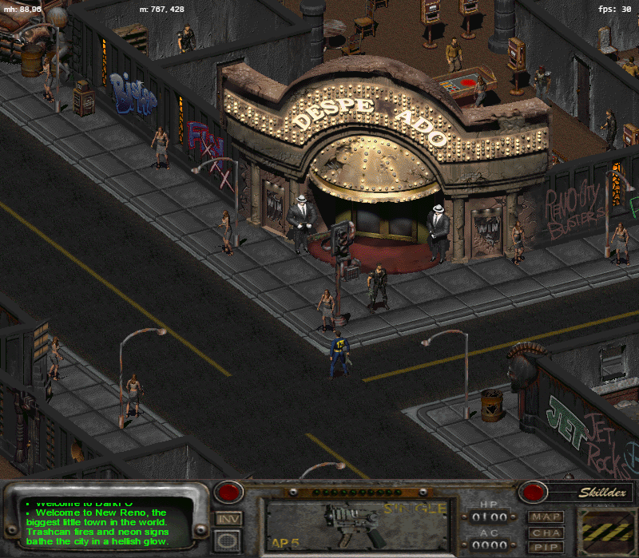

# DarkHarold2

A post-nuclear RPG remake

This is a modern reimplementation of the engine of the video game [Fallout 2](http://en.wikipedia.org/wiki/Fallout_2), as well as a personal research project into the feasibility of doing such.

The project is based on [darkfo](https://github.com/darkf/darkfo) codebase, but is modernized for Python 3, potentially
with more improvements and bug fixes coming in the future.

It is written primarily in TypeScript and Python, and targets recent browsers with WebGL 2.0 support.

## Status

DarkHarold2 is not a complete remake at this time. Estimated overall completion: **~94%** (target: **100%**).
The core technical foundation (rendering, combat math, scripting VM, map loading, dialogue runtime) is
solid, and most gameplay systems are now wired end-to-end; the 2026-07-02 lighting-alignment sprint closed
the last major rendering block. The remaining gaps are concentrated in asset-pipeline extractions,
speech/movie infrastructure, and a handful of larger systems (car travel, per-town reputation, NPC daily
schedules) — all enumerated in **Phase 10 (Path to 100%)**. See [`ROADMAP.md`](ROADMAP.md) and
[`wiki/known_bugs.md`](wiki/known_bugs.md) for the canonical trackers.

If you're looking for documentation on how Fallout 2 works, documentation on certain file formats, or
tools to work with them, this project will be useful to you as well.



---

## Project Index / New Contributor Readthrough Guide

If you're new to the codebase, read these files in the order below. The list mirrors how
existing maintainers stay oriented; each section builds on the previous.

### 🗺️ Start here

| File | Purpose |
|---|---|
| [`README.md`](README.md) | This file — project overview, completion status, build commands |
| [`CLAUDE.md`](CLAUDE.md) | AI-assistant instructions, research workflow, architecture rules, what NOT to implement |
| [`ROADMAP.md`](ROADMAP.md) | Phased plan toward 100% (Phases 1–10); canonical completion estimate |

### 📐 Architecture & codebase

| File / dir | Purpose |
|---|---|
| [`CODEBASE.md`](CODEBASE.md) | Full module map, repository layout, file responsibilities, key data flows |
| `src/` | TypeScript engine (renderer, object, critter, vm, scripting, combat, party, …) |
| `src/main.ts` | Main game loop, input handling, map-load entry |
| `src/heart.ts` | 60 Hz heartbeat loop |
| `src/globalState.ts` | Central game-state singleton (`gMap`, `player`, `combatActive`, …) |
| `src/config.ts` | Engine / UI / scripting / combat flags |
| `shaders/` | GLSL shaders (vertex, fragment, lighting, font) |
| `lut/` | Pre-baked JSON lookup tables (LST indexes, crit tables, palette data) |

### 📚 Wiki (read in this order)

Pre-audited summaries of CE behaviour with DH2 gaps already identified. Trust these over raw CE source reads.

| Order | File | Topic |
|---|---|---|
| 1 | [`wiki/README.md`](wiki/README.md) | Wiki index and lookup-order rules |
| 2 | [`wiki/CODEBASE_FOCE.md`](wiki/CODEBASE_FOCE.md) / [`wiki/CODEBASE_jsFO.md`](wiki/CODEBASE_jsFO.md) | Reference-source orientation |
| 3 | [`wiki/CROSS_CHECK_NOTES.md`](wiki/CROSS_CHECK_NOTES.md) | Where DH2 disagrees with CE/jsFO and why |
| 4 | [`wiki/known_bugs.md`](wiki/known_bugs.md) | **Canonical bug/feature tracker** — S/C/P/U/FA/RD/LE/IW/CI categories with fix status |
| 5 | [`wiki/animation.md`](wiki/animation.md) | FRM format, atlas system, `artOffset` zero-jump model, FA-series known gaps |
| 6 | [`wiki/failed_animation_offset_attempts.md`](wiki/failed_animation_offset_attempts.md) | Full post-mortem of pixel-drift fix attempts (Attempts 0–7) |
| 7 | [`wiki/rendering.md`](wiki/rendering.md) | WebGL pipeline, z-sort, lighting passes, accepted deviations |
| 8 | [`wiki/combat.md`](wiki/combat.md) | Combat loop, hit/damage formulas, crit tables, AI turns |
| 9 | [`wiki/weapon_combat.md`](wiki/weapon_combat.md) | Weapon AP costs, burst spread, called shots, reload |
| 10 | [`wiki/damage_formula.md`](wiki/damage_formula.md) | Per-step damage math (RD → DT → DR → CM → final) |
| 11 | [`wiki/ai_behavior.md`](wiki/ai_behavior.md) | AI packets, distance modes, perception, taunts |
| 12 | [`wiki/scripting_vm.md`](wiki/scripting_vm.md) | VM architecture, three-file split (`vm.ts`/`vm_bridge.ts`/`scripting.ts`) |
| 13 | [`wiki/scripting_reference.md`](wiki/scripting_reference.md) | Opcode reference and coverage table |
| 14 | [`wiki/dialogue_system.md`](wiki/dialogue_system.md) | Dialogue runtime, MSG files, `gsay`/`giq` chain |
| 15 | [`wiki/worldmap.md`](wiki/worldmap.md) | Worldmap travel, encounter tables, area entrances |
| 16 | [`wiki/map_scripting.md`](wiki/map_scripting.md) | Map-level script hooks (`map_enter_p_proc`, etc.) |
| 17 | [`wiki/items.md`](wiki/items.md) | Item system, weights, stacking rules |
| 18 | [`wiki/proto_system.md`](wiki/proto_system.md) | Proto binary layout (types 0–5) and JSON schema |
| 19 | [`wiki/file_formats.md`](wiki/file_formats.md) | DAT2/FRM/PRO/MSG binary layouts |
| 20 | [`wiki/character_stats.md`](wiki/character_stats.md) / [`wiki/critter_stats.md`](wiki/critter_stats.md) | SPECIAL stats, derived stats, base ranges |
| 21 | [`wiki/perks_traits.md`](wiki/perks_traits.md) | Perk and trait registries, effects |
| 22 | [`wiki/skill_checks.md`](wiki/skill_checks.md) | Skill-use rolls, modifiers, XP awards |
| 23 | [`wiki/companion_party.md`](wiki/companion_party.md) | Party system, CHA cap, follow logic |
| 24 | [`wiki/quest_system.md`](wiki/quest_system.md) | Quest GVAR tracking, Pip-Boy ARCHIVES |
| 25 | [`wiki/pipboy.md`](wiki/pipboy.md) | Pip-Boy panels, AUTOMAP, clock/alarm |
| 26 | [`wiki/interface_windows.md`](wiki/interface_windows.md) | HUD, character/inventory windows, indicator bar |
| 27 | [`wiki/hotkeys.md`](wiki/hotkeys.md) | Default keybindings |
| 28 | [`wiki/save_load.md`](wiki/save_load.md) | Save/load format, IndexedDB slots, thumbnails |
| 29 | [`wiki/time_clock.md`](wiki/time_clock.md) | In-game time, day/night cycle, midnight queue |
| 30 | [`wiki/spatial_triggers.md`](wiki/spatial_triggers.md) | Spatial trigger system |
| 31 | [`wiki/tile_system.md`](wiki/tile_system.md) | Tile grid, hex math, screen projection |
| 32 | [`wiki/pathfinding.md`](wiki/pathfinding.md) | A\* path-blocking vs shoot-blocking, MULTIHEX |
| 33 | [`wiki/lighting.md`](wiki/lighting.md) | Lightmap, ambient curve, object light emission |
| 34 | [`wiki/sound_system.md`](wiki/sound_system.md) | Audio engine, GainNode chain, ambient SFX |
| 35 | [`wiki/economy.md`](wiki/economy.md) | Caps, barter formula, vendor stock |
| 36 | [`wiki/faction_reputation.md`](wiki/faction_reputation.md) | Karma, town reputation, title tiers |
| 37 | [`wiki/status_effects.md`](wiki/status_effects.md) | Poison, radiation, addictions, drug effects |
| 38 | [`wiki/random_numbers.md`](wiki/random_numbers.md) | PRNG seeding, `rollSkillCheck` ranges |
| 39 | [`wiki/settings.md`](wiki/settings.md) | Config/preferences system |
| 40 | [`wiki/actions.md`](wiki/actions.md) | `actions.cc` dispatch, death animations, float text |
| 41 | [`wiki/endgame.md`](wiki/endgame.md) | Endgame slides, death narrator |
| 42 | [`wiki/extended_flags.md`](wiki/extended_flags.md) | Wall/scenery `extendedFlags` orientation bits — egg occlusion vs light blocking |
| 43 | [`wiki/alignment.md`](wiki/alignment.md) | Screen-space anchor reference for all renderable categories (floor/roof `−96`, object bottom-centre anchor, `uniformFrameWidth` vs `frameWidth`, `8.4` lightmap-UV inverse) **plus the lighting-alignment work** — centring offset (RD17 §6), interpolation stripes / `hex-lerp` (§7), W-E wall occlusion (LD11 §8), object light-sampling modes (`wall-clamp` default), alpha-silhouette wall top-fade, and moving-torch smoothing (`egg-split`); §9 lists all runtime `setLighting*/setObjectLighting*/setWallTopFade*/setPlayerLightSmooth` console commands |

### 🐛 Known issues & roadmap

| File | Purpose |
|---|---|
| [`wiki/known_bugs.md`](wiki/known_bugs.md) | Primary tracker — fix status per ID across all subsystems |
| [`ROADMAP.md`](ROADMAP.md) | Phased plan (Phases 1–10) toward 100% with audit dates |
| [`TODO.md`](TODO.md) | Older free-form TODO list — superseded by `wiki/known_bugs.md` |
| Inline `// TODO` / `// FIXME` in `src/` | Source-level annotations |
| [`CLAUDE.md`](CLAUDE.md) → "Intentionally Incomplete Systems" | Explicit out-of-scope / "do not implement unless asked" |

### 🔧 Asset pipeline (Python 3.9+)

All pipeline scripts live under [`tools/`](tools/) (moved from the repository root
2026-06-18 for a cleaner layout). `tools/setup.py` orchestrates the full extraction; the
rest are reusable converters. Run everything from the **project root** (output paths
like `art/`, `proto/`, `maps/`, `lut/` are relative to your current directory, not to
the scripts' location):

```
pipenv run python tools/setup.py /path/to/Fallout2/installation/directory
```

Or use the graphical front-end — lets you pick which stages to run, whether to
overwrite already-generated output, and whether to delete the raw source files
(FRM/PRO/MAP/ACM) once converted (not needed for a real install, just for re-running
the pipeline):

```
pipenv run python tools/pipeline_gui.py
```

| File | Purpose |
|---|---|
| [`tools/setup.py`](tools/setup.py) | Full extraction pipeline — runs every other converter in order; `--stages`, `--skip-existing`, `--delete-originals` flags |
| [`tools/pipeline_gui.py`](tools/pipeline_gui.py) | Tkinter GUI front-end for `tools/setup.py` |
| [`tools/exportImagesPar.py`](tools/exportImagesPar.py) | FRM → PNG sprite exporter (parallel) |
| [`tools/frmpixels.py`](tools/frmpixels.py) | FRM pixel helpers and atlas generation |
| [`tools/exportPRO.py`](tools/exportPRO.py) / [`tools/proto.py`](tools/proto.py) | PRO binary → JSON |
| [`tools/fomap.py`](tools/fomap.py) | MAP → JSON (tiles, objects, spatials, lights) |
| [`tools/convertAudio.py`](tools/convertAudio.py) | ACM → WAV (uses `acm2wav`) |
| [`tools/dat2.py`](tools/dat2.py) | DAT2 archive extractor |
| [`tools/pal.py`](tools/pal.py) | PAL palette loading |
| [`tools/fonts.py`](tools/fonts.py) | FON font extraction |
| [`tools/convertLST.py`](tools/convertLST.py) | LST → JSON pre-bake (`lut/lst/`) |
| [`tools/convertPRO.py`](tools/convertPRO.py) | Standalone PRO converter (debug) |
| [`tools/convertEndgame.py`](tools/convertEndgame.py) | Endgame slide extraction |
| [`tools/parseCritTable.py`](tools/parseCritTable.py) / [`tools/parseElevatorTable.py`](tools/parseElevatorTable.py) | EXE table extractors → `lut/` |
| [`tools/stitchWorldmap.py`](tools/stitchWorldmap.py) | One-off worldmap.png tile stitcher |
| [`tools/mpserv.py`](tools/mpserv.py) | Multiplayer WebSocket server (unrelated to asset conversion) |
| [`tools/oldPy/`](tools/oldPy/) | Superseded/experimental script iterations, kept for reference only |
| [`wiki/animation.md`](wiki/animation.md) → "imageMap.json" | Atlas/imageMap.json schema reference |

---

## Feature completion

The buckets below are sourced from [`wiki/known_bugs.md`](wiki/known_bugs.md) (current
audit: 2026-06-25). Items marked FIXED there roll up here. If you spot a contradiction,
the wiki tracker is the source of truth.

### ✅ Substantially implemented (~85–95%)

- **Map loading & rendering** — tile maps, multi-elevation, WebGL 2.0 renderer, lightmap, real-time lighting, screen-space hex z-sort (RD09), camera clamp + `OBJECT_SCROLL_BLOCK` (RD11/RD12), per-building roof flood-fill (RD06), parity-correct lightmap hex sampling with selectable interpolation (RD17, default `hex-lerp`), directional wall light occlusion via `extendedFlags` (LD11), per-column wall light sampling (`wall-clamp` default), and smooth moving-torch lighting (`egg-split`); an alpha-silhouette wall top-edge fade exists but ships **off** (no reliable "wall meets roof" gate) — see [`wiki/alignment.md`](wiki/alignment.md)
- **Walking & running** — A\* pathfinding with separate path-blocking / shoot-blocking predicates (P4/P5/P6), `OBJECT_MULTIHEX` neighbour scan, scenery LoS via `OBJECT_LIGHT_THRU` (P7), door interaction, exit grids
- **Combat core** — hit/damage formulas (YAAM), ammo X/Y/DR/AC modifiers, burst fire, called shots, 6-level criticals + Better Criticals, critical failures, armor DR/DT per damage type, crippled limbs, knockdown/knockout, DAM_DROP, fire DoT, partial cover, AI team targeting + perception gate + LoS, AI distance modes (charge / snipe / stay / stay_close), combat-turn explosion timer (T1), combat walk-speed bonus (FA4), per-damage-type death animations + `CRITTER_SPECIAL_DEATH`, float-text colour + stacking (AC8)
- **Combat perks** — Slayer, Sniper, Sharpshooter, Bonus HtH Attacks, Bonus Rate of Fire, Better Criticals, Stonewall, Fast Reload, Finesse, Healer, Pathfinder, Pickpocket, and more
- **Dialogue** — `start_gdialog` / `gSay_Start` / `giq_option` / `gsay_message` / `gsay_reply` / real fixed-position Barter + Combat Control buttons (P9), `gdialog_set_barter_mod`, float messages, reenter-dialogue on sub-screen return, walk-to-NPC before talk (P15), caps readout in dialogue window (P16), dialogue review log + scrollable modal (P17/P18), screen-curvature highlight overlays (P22)
- **Bartering** — CE-accurate `_barter_compute_value`, reaction LVAR, Master Trader perk, difficulty bonus; outer-list scroll buttons (P19), offer-table scroll buttons (P20), barter/trade skin selection (P14); movemult quantity picker: BIGNUM 5-digit display, item icon, ALL button, CE-accurate hit zones (P23/P24)
- **Companion screens** — `partyMemberControlWindowInit`/`partyMemberCustomizationWindowInit` (P5/P8): disposition presets, 6-category custom AI, weight-based trade, `#dialogueContainer`-integrated panel swap via `uiSwapDialoguePanel()`, correct return-path rules (Customize→Control→Talk, Trade→Talk), persistent background window across transitions
- **Inventory UI** — drag-and-drop, equip slots, weight display + carry-weight enforcement (LE1), reload + ammo state-aware stacking (LE4), `pickup_p_proc` on inventory equip (LE6), container `use_p_proc` gate (LE9), multi-pile caps sum (LE11)
- **Active skill use** — First Aid, Doctor, Sneak, Lockpick, interactive Steal UI (`ui_steal.ts`: per-item size/facing/knockdown/session-count rolls, real double-roll catch mechanic, K3), Traps, Science, Repair, Gambling/Outdoorsman messages; Healer perk applied; party-member delegation for First Aid/Doctor (AC6)
- **Level-up & perks** — XP thresholds, skill points (5 + 2×INT, +2 Educated), HP per level (END/2 + 2, +4 Lifegiver), perk every 3 levels (every 4 Skilled), **perk selection modal** (`ui_character.ts:1866 showPerkModal`), Tag! 4th slot
- **Karma & reputation** — `get_pc_stat` / `mod_pc_stat` / `set_pc_stat` wired, +1 karma per hostile kill, **karma title computation** (`ui_character.ts:581–624`), STATUS panel surfaces both stats, per-town reputation tracked and displayed (R2)
- **Worldmap travel** — 28×30 grid, per-tile encounter tables, time-of-day frequency (W1), difficulty modifier (W2), encounter formations (straight_line/double_line/wedge/cone) (W6), encounter critters carry items + equipped weapons (W3), Outdoorsman detection XP (W7), Pathfinder travel-time reduction; keyboard/mouse-edge map pan (W12); label list CE-accurate filter + alphabetic sort (W11)
- **Random encounters** — encounter group generation, level/time_of_day conditions, encounter counter (W4)
- **Scripting VM** — INT file parser, **~150+ opcodes wired**, transpiler/disassembler; remaining stubs are largely car-system or movie/credits sub-ops (see [`wiki/known_bugs.md §2`](wiki/known_bugs.md))
- **Audio engine** — music looping, weapon/action sound mapping, ambient SFX from map data, master/music/sfx GainNode chain with persisted volume sliders
- **Pip-Boy** — clock display, alarm button (CE geometry IW10), STATUS/QUESTS/ARCHIVES/AUTOMAP tabs with per-location map view + zoom/pan, IndexedDB persistence; rest/wait menu renders inside the Pip-Boy screen with all 13 CE options including "Until healed" (IW11); month sprite stride/position corrected (IW10)
- **Character screen / HUD** — full SPECIAL/skill view, stat display, trait/perk lists, indicator bar (SNEAK/POISONED/RADIATED/ADDICT) (IW1), AP-light fade animation (IW7), attack button greyed when AP insufficient (IW2), `game_ui_disable` hides HUD bar (IW4)
- **Save / load** — IndexedDB-backed; player state, inventory + ammo state, stats/skills/traits/perks, level/XP, equipped items, GVARs, MVARs (U5), knownAreas (U6), timed-event queue (U7), 160×100 JPEG save-slot thumbnails (U3)
- **Status effects** — drug / chem effect timers with addiction rolls (5a), poison + radiation decay loops (5b)
- **Animations** — FRM sprite rendering with `artOffset` zero-jump model (FA7), correct frame-0 timing (FA9), symmetric walk-cycle partials (FA10), weapon-draw drift fix (FA12)
- **Rendering** — per-building roof flood-fill clipping (RD06), egg transparency with CE 4-case `extendedFlags` branch + `'alpha'` radial mode (RD16), combat/item/neutral critter outline system with fill/border alpha (CI11–CI15), worldmap pan/scroll with arrow/WASD/mouse-edge input (W12)
- **Preferences** — full options panel (difficulty, combat speed, violence level, target-highlight 3-state (CI8), item highlight (CI7/CI12), run-by-default (CI4), subtitles, speech/SFX/music volume, brightness slider stub) persisted via localStorage; hover-only item highlight matching CE `gameMouseLoadItemHighlight` (CI12)

---

### 🔶 Partially implemented (~30–69%)

- **Traits** — 2 of 16 traits (Gifted, Good Natured) affect skill calculations; no trait selection at character creation; no 2-trait slot limit enforced.
- **Character creation** — SPECIAL point-buy and tag-skill selection present. Trait selection and name/age/sex entry incomplete.
- **Party / companions** — `addPartyMember` (CHA cap), `followPlayer` pathfinds to a free hex adjacent to the player, `dismissPartyMember` and silent `party_remove`, combat AI for friendly-team members, full companion control/customize/trade screens integrated into persistent dialogue window (P5/P8), correct return-path rules (P8). **Missing:** companion level-up, formation pathfinding, Use Best Weapon/Armor AI heuristics.
- **Lighting** — `obj_set_light_level` + `set_obj_visibility` correctly rebuild the lightmap (LD3/LD4), hidden objects no longer emit light (LD1), directional wall occlusion reads `extendedFlags` so W-E walls no longer bleed light (LD11), and the player's moving torch is stamped smoothly sub-tile (`egg-split`, default) instead of snapping per tile. Day/night ambient curve is a DH2 invention rather than CE-matched (GTC10); `objectGetLightIntensity` self-subtraction absent (LD5); non-wall opaque-object shadowing still stubbed (LD11 note).
- **Time & date system** — `gametime.ts` ticks, day/night ambient curve, midnight queue fires `objectUnjamAll` (IU3/GTC5); `get_month` / `get_day` wired; ARTIMER midnight movie events still not implemented.
- **Quest system** — `questData.ts` covers all major Fallout 2 quests with GVAR-based state tracking; Pip-Boy ARCHIVES tab surfaces them. Per-quest completion rewards/XP route through scripts but not engine-side. Quest descriptions inlined in TS rather than loaded from `quests.msg`.
- **Combat AI** — friendly-fire gate for AoE attacks (line-of-fire blockers between attacker and target) still absent; otherwise distance modes, perception, taunts, and team targeting are wired.
- **Worldmap** — area entrance positions on area screens fixed (W9, a fixed 22/21px CE window-vs-map-origin offset); walk masks (`.msk` impassable-terrain bitmaps — oceans, mountains) now loaded and enforced during travel (W10).
- **Endgame** — death-narrator slide wired (EG6); credits music / `creditsOpen("credits.txt")` (EG4) and panning-slide ms/pixel timing (EG3) still absent.

---

### ❌ Not implemented or deliberately deferred

- **NPC schedules / day-night behaviour** — non-scripted critters do radius-capped wander (C8) only; full home/work/sleep schedules deferred (P2).
- **Per-town reputation tracking** — global karma + title work; per-town faction deltas and reaction modifiers absent (R2).
- **Car travel system** — no car fuel, no car-speed multipliers, no encounter-rate reduction (W8).
- **Subtitles / speech file playback** — audio engine has no `.acm` speech hooks; no subtitle overlay (P4).
- **Movie / FMV playback** — `play_gmovie` is a no-op (S15); ARTIMER midnight movies (GTC5).
- **`actionFrame` from FRM headers** — discarded by `tools/frmpixels.py:40`; hit/sound sync absent for weapon attacks (FA3, asset-pipeline change).
- **FID weapon-stance composition** — partially wired via `Weapon.getAnim` skin codes; CE `buildFid` parity not verified (FA6).
- **Two-pass flat / post-roof object rendering** (RD07/RD08), **palette colour cycling** for water/fire (RD10), **pixel-precise hex hit-testing** via `_tile_mask` (RD13), **elevation transition fade** (RD14).

See [`wiki/known_bugs.md`](wiki/known_bugs.md) for the complete tracker with CE references and fix
status per ID.

---

## Roadmap

[`ROADMAP.md`](ROADMAP.md) is the canonical phased plan (Phases 1–10) toward 100% parity; the 95%
playable-main-quest milestone is essentially met and **Phase 10 (Path to 100%)** tracks the remainder.
The most recent audit (2026-07-04) added Phase 10 and confirmed the 2026-07-02 lighting-alignment sprint;
the prior 2026-06-25 audit closed 60+ items since 2026-06-04: the complete
companion/dialogue state machine (P5–P20), barter screen CE-accuracy (P14, P19–P21, P23–P24),
worldmap scroll+labels (W11/W12), Pip-Boy rest+clock (IW10/IW11), per-building roof clipping
(RD06), egg transparency (RD16), outline system (CI11–CI15), and earlier preference/HUD/scripting
gaps. See the file header for the per-phase breakdown.

[`CLAUDE.md`](CLAUDE.md) → "Intentionally Incomplete Systems" lists features that are deliberately
out of scope unless explicitly requested.

---

## Data Pipeline

### Philosophy
The long-term goal is for the engine to own all its data in clean, typed, pre-baked JSON — no runtime parsing of original Fallout 2 file formats. Every conversion step that moves data out of `.lst`, `.pro`, `.ini`, or `.msg` files and into `lut/` is a step toward a fully self-contained engine that doesn't depend on the original file layout at runtime.

The existing `lut/` directory already follows this pattern:
- `lut/criticalTables.json` — crit tables extracted from the EXE
- `lut/elevators.json` — elevator data extracted from the EXE
- `lut/color_lut.json`, `lut/color_rgb.json` — palette data

LST files are next.

### LST → JSON pre-bake (`tools/convertLST.py`)
All Fallout 2 `.lst` files are converted to JSON arrays at setup time by `tools/convertLST.py` and written to `lut/lst/`. Each file is a plain JSON array indexed by line number, preserving exact indices.

**Naming convention:** consecutive duplicate path components are collapsed.

| Source | Output |
|---|---|
| `data/art/critters/critters.lst` | `lut/lst/art_critters.json` |
| `data/proto/critters/critters.lst` | `lut/lst/proto_critters.json` |
| `data/art/items/items.lst` | `lut/lst/art_items.json` |
| `data/art/scenery/scenery.lst` | `lut/lst/art_scenery.json` |
| `data/art/misc/misc.lst` | `lut/lst/art_misc.json` |
| `data/art/intrface/intrface.lst` | `lut/lst/art_intrface.json` |
| `data/scripts/scripts.lst` | `lut/lst/scripts.json` |

**Critical:** the converter splits on `'\n'` exactly — not `splitlines()` — to match the behaviour of `data.ts::loadLst()`. Any deviation will cause silent index drift in FRM resolution.

### Migration strategy
The runtime LST path (`data.ts::getLstId()`) is **not removed** — it stays intact as a fallback while call sites are migrated one at a time.

A parallel helper `getLstJson(lst, id)` reads from `lut/lst/` instead. Call sites in `pro.ts` are the primary migration target:

| Call site | LST | Status |
|---|---|---|
| `pro.ts::getCritterArtPath()` | `art/critters/critters` | 🔜 next |
| `pro.ts::lookupInterfaceArt()` | `art/intrface/intrface` | 🔜 next |
| `pro.ts::lookupArt()` | `art/items/items`, `art/scenery/scenery`, `art/misc/misc` | 🔜 next |
| `pro.ts::loadPRO()` | `proto/critters/critters` + 4 others | 🔜 next |
| `data.ts::lookupScriptName()` | `scripts/scripts` | later |

Skilldex and audio do **not** use LSTs and are not part of this migration.

When all call sites in a file are migrated, `getLstId()` calls in that file are removed. Once all files are migrated, `getLstId()` and `loadLst()` in `data.ts` are deleted.

## Installation

To use this, you'll need a few things:

-   A copy of Fallout 2 (already installed). You can buy one on [GOG](https://www.gog.com/en/game/fallout_2), download
    the standalone installer, and unpack on any platform supported by
    [innoextract](https://github.com/dscharrer/innoextract), or run the installer `.exe` if you're on Windows.

The rest of the dependencies can be installed all at once if you're on macOS and using [Homebrew](https://brew.sh).
Just run this command in the directory of your repository clone:

```
brew bundle
```

Otherwise you can install the dependencies manually:

-   Python 3.9 or later, earlier minor versions of Python 3 may work, but are not tested. Python 2 is not supported.

-   [Pipenv](https://github.com/pypa/pipenv) for Python dependency management.

-   The TypeScript compiler, installed via `npm install` (you'll need [node.js](https://nodejs.org/en/)).

Once you've got all that, you can start trying it out.

Open a command prompt inside the DarkHarold2 directory, and then run:

```
pipenv install
pipenv shell
python tools/setup.py path/to/Fallout2/installation/directory
```

Or use the graphical front-end (`python tools/pipeline_gui.py`) to pick which stages to
run, whether to overwrite existing output, and whether to delete the raw source files
once converted.

This will take a few minutes, it's unpacking the game archives and converting relevant game data into a format DarkHarold2 can use.

You'll need an HTTP server to run (despite being all static content) due to the way browsers sandbox requests.
If you're comfortable with setting up nginx, lighttpd, or Apache, go for that. If not, a simple way is to use Python:

-   Python 3: `python -m http.server`

Then run `npx tsc` after you've run `npm install` to compile the source code.

Browse to `http://localhost/play.html?artemple` (or whatever port you're using). If all went well, it should begin the game. If not, check the JavaScript console for errors.

Alternatively, Firefox can load directly from `file://` by opening `play.html` file.

Review `src/config.ts` for engine options. Be sure to re-compile if you change them.

OPTIONAL: If you want sound, run `python tools/convertAudio.py`. You'll need the `acm2wav` tool (you can get it from No Mutants Allowed), placed in the project root.

## Debug Logging

All debug output is off by default and toggled at runtime via `Config.scripting.debugLogShowType`.
Flags are plain booleans on the global `Config` object — no rebuild needed.

### Enabling flags at runtime

Enable a single category in the browser DevTools console:

```js
Config.scripting.debugLogShowType.rolls = true
```

Enable multiple categories at once:

```js
Object.assign(Config.scripting.debugLogShowType, { combat: true, ai: true, damage: true })
```

### Flag reference

| Flag | Default | What it logs |
|------|---------|--------------|
| `stub` | `true` | Unimplemented script opcodes |
| `log` | `false` | `script log()` calls |
| `timer` | `false` | Timed event fire/cancel |
| `load` | `false` | Script file loads |
| `debugMessage` | `true` | `debug_message()` from scripts |
| `displayMessage` | `true` | `display_message()` (in-game console) |
| `floatMessage` | `false` | Floating critter messages |
| `gvars` | `false` | Global variable reads/writes |
| `lvars` | `false` | Local variable reads/writes |
| `mvars` | `false` | Map variable reads/writes |
| `tiles` | `true` | Tile/elevation changes |
| `animation` | `false` | Animation state transitions |
| `movement` | `false` | Pathfinding steps |
| `inventory` | `true` | Inventory add/remove |
| `party` | `false` | Party member status |
| `dialogue` | `false` | Dialogue node entry/exit |
| `combat` | `false` | Turn flow, enrollment, forceEnd |
| `ai` | `false` | AI packet lookup, action chosen, AP spent |
| `rolls` | `false` | Hit chance, roll result, hit/miss/crit |
| `skills` | `false` | Skill check rolls and outcomes (Lockpick, Doctor, Steal, …) |
| `damage` | `false` | Full damage formula: RD/CM/ADR/ADT/Base/Adj/Final |
| `script` | `false` | Script execution tracing (verbose) |
| `map` | `false` | Map load, exit grid, elevation |
| `object` | `false` | Object create/destroy/flags |
| `audio` | `false` | Audio load/play/stop |
| `renderer` | `false` | WebGL draw calls |
| `lighting` | `false` | Lightmap recalculation |
| `worldmap` | `false` | Worldmap travel and transitions |
| `encounters` | `false` | Random encounter rolls |
| `saveload` | `false` | Save/load slot operations |

### Example: auditing a combat encounter

1. Load `play.html?artemple`
2. In DevTools console:
   ```js
   Config.scripting.debugLogShowType.rolls = true
   Config.scripting.debugLogShowType.damage = true
   Config.scripting.debugLogShowType.ai = true
   ```
3. Trigger combat with a Giant Ant
4. Expected DevTools output:
   ```
   [ai]    [AI] Giant Ant turn start — AP: 10, packet: Giant Ant
   [ai]    [AI] Giant Ant → attack on you (AP cost: 4)
   [rolls] Giant Ant attacks you — hit chance: 45%
   [rolls] Giant Ant misses you. (roll: 67 vs target: 45)
   [damage] RD: 3 | CM: 2 | ADR: 30 | ADT: 4 | Base: 3 | Adj: 0 | Final: 0
   ```

Player-visible results (hits, damage, kills) still appear in the in-game console regardless of these flags.

## Combat Log

Every combat event (turn start/end, attack rolls, damage, AI decisions, kills) is appended to a structured in-memory log as `EventLogEntry` objects. The log persists across map changes and is saved with the save game, so you can review a full fight's history even after it ends.

### Exporting

Open the browser console during or after combat and call:

```js
exportEventLog()             // defaults to "full" tier
exportEventLog("summary")
exportEventLog("diagnostic")
```

This downloads a JSON file named `eventLog_<tier>_<timestamp>.json`.

You can also inspect the live log without downloading:

```js
__eventLog              // the full array
__eventLog.length       // number of entries recorded so far
```

### Tiers

| Tier         | Fields included                                                                 | Use case                          |
|--------------|---------------------------------------------------------------------------------|-----------------------------------|
| `summary`    | `round`, `turn`, `actor`, `action`, `result`, `damage` (only when > 0)         | Quick sanity check, who did what  |
| `full`       | All fields except `RD`, `DT`, `DR`, `CD`, `ammoX`, `ammoY`, `critMultiplier`, `critChance` | Normal debugging session |
| `diagnostic` | Every field, unfiltered                                                         | Chasing damage formula bugs       |

### Persistence

The event log is serialised into the save game. When a save is loaded, `globalState.eventLog` is restored from the file, so the full fight history is available even after a page reload. Saves written before the `eventLog` field was introduced are loaded cleanly (the log starts empty).

## FAQ

**Note**: This section has been copied from `README.md` of DarkFO, the answers don't represent opinions of the current maintainer
of DarkHarold2 and are only given to explain the status quo. The technical direction of DarkHarold2 may change in the future.

-   **Q:** Why TypeScript? Why a browser?

    A: Everyone has a browser: it's a portable platform for running code with more features than people expect.
    There are other projects that use native code already... and are already seeing segfaults. :)

    The project started out in JavaScript and was ported to TypeScript as it was continuing to grow. TypeScript strikes
    an excellent balance between useful and safe.

-   **Q:** But why Python?

    A: Python is actually quite fast when written well, despite many peoples' expectations. It is very elegant and allows me to write
    backend code like file parsers and exporters with tiny code, very few troubles, and that I know is portable and safe.

-   **Q:** Why do I need `acm2wav` for sound?

    A: Because it hasn't been ported to Python yet. If you're willing to contribute, give it a shot: the original Pascal source code is available online.

    Additionally, FFmpeg might be able to transcode ACM audio, so give that a shot. (See [darkf/darkfo#30](https://github.com/darkf/darkfo/issues/30))

-   **Q:** Why convert all assets up front, why not load them directly?

    A: Because it would require more processing time to load them each time they're needed rather than having them already in a sane, modern format.

    By converting, for example, FRMs (a proprietary Interplay format) to PNGs (a ubiquitous, open modern format) we allow normal browsers or image viewers to open them, as well as edit them -- a huge win for modders. Other games or tools could take advantage of the new formats as well.

-   **Q:** Why do this at all?

    A: Why not? It's a fun project, and I love Fallout. Fallout 1 and 2 do not run particularly well on modern machines, even with engine hacks. They're also hard to mod -- I'd like to change that.

## Development / Debug

`src/debug.ts` exports a typed `debug` object with cheat/testing utilities.
It is a **no-op in production** — all methods return immediately unless
`Config.engine.debug` is `true`.

### Enabling

Open `src/config.ts` and flip the flag:

```ts
engine: {
    debug: true,   // ← change this
    ...
}
```

Rebuild (`npx tsc`) and reload the page.

### Using from the Browser DevTools

Because the game uses ES modules you cannot call `debug.*` directly in the
DevTools console. Use a dynamic import snippet instead:

```js
const { debug } = await import('./js/debug.js')
debug.addXP(2000)
```

Or wire it once per session at the top of a console snippet:

```js
window._debug = (await import('./js/debug.js')).debug
_debug.addXP(2000)
```

### Available methods

| Method | Description | Example |
|---|---|---|
| `addXP(n)` | Add `n` experience points. Fires level-up and opens the perk picker if the XP threshold is crossed. | `debug.addXP(2000)` |
| `setHP(n)` | Set player current HP to `n`. | `debug.setHP(1)` |
| `setKarma(n)` | Set player karma to `n`. Clamped to ±99999999. | `debug.setKarma(500)` |
| `combatLog()` | Returns the current `eventLog` array (same data exported by the Combat Log tools). | `debug.combatLog()` |
| `teleport(map)` | Load a map by name. | `debug.teleport('artemple')` |
| `giveItem(pid)` | Add an item with the given prototype ID to the player's inventory. | `debug.giveItem(41)` (caps) |
| `step(dtMs?)` | Advance the engine one logical frame without waiting for `requestAnimationFrame`. Used internally by the AutoCrawler; also useful for stepping through scripted sequences manually. | `debug.step()` |
| `movePlayer(tileNum)` | Teleport the player to a tile by number within the current map (no map reload). | `debug.movePlayer(18040)` |
| `crawlerMode(on)` | Silence noisy log categories (`stub`, `dialogue`, `combat`, `ai`) and set difficulty to neutral for a clean crawler run. | `debug.crawlerMode(true)` |

### Quick level-up test (no debug flag needed)

The classic one-liner works in any DevTools console without enabling debug
mode, because `globalState` is already exposed on `window`:

```js
globalState.player.addExperience(2000)
```

This triggers a level-up and opens the perk selection modal, useful for
testing the perk picker during development.

## AutoCrawler

The AutoCrawler is an automated testing tool that exercises dialogue trees and combat encounters
without manual intervention. It runs entirely at engine speed (no `requestAnimationFrame` delays)
and is exposed on `window.autoCrawler` when `Config.engine.debug` is `true`.

### Prerequisites

Enable debug mode in `src/config.ts`, rebuild (`npx tsc`), and load the game in the browser.
The crawler is imported automatically — no extra steps needed.

### Usage

All commands run from the browser DevTools console. Commands that start a crawl return a
`CrawlerReport` object. Pass it to `autoCrawler.downloadReport()` to save the result as JSON.

#### URL auto-start

Load the page with a `?crawl=` parameter to start a crawl automatically after the game initialises.
No DevTools interaction needed.

| URL | Equivalent to |
|---|---|
| `play.html?crawl=dialogue` | `autoCrawler.runDialogueCrawler()` on the default map |
| `play.html?crawl=combat` | `autoCrawler.runCombatCrawler()` on the default map |
| `play.html?crawl=maps` | `autoCrawler.runMapCrawler()` — smoke-tests all 156 maps |

To run on a specific map, call the function manually from the console after load (see below).

#### Console commands

**Crawl all talkable NPCs on the current map:**

```js
const report = await autoCrawler.runDialogueCrawler()
autoCrawler.downloadReport(report)
```

**Crawl all talkable NPCs on a named map (loads the map first):**

```js
const report = await autoCrawler.runDialogueCrawler('artemple')
autoCrawler.downloadReport(report)
```

**Crawl all hostile critters on the current map:**

```js
const report = await autoCrawler.runCombatCrawler()
autoCrawler.downloadReport(report)
```

**Crawl all hostile critters on a named map:**

```js
const report = await autoCrawler.runCombatCrawler('modmeeting')
autoCrawler.downloadReport(report)
```

**Smoke-test every map (load, check player position, record result):**

```js
const report = await autoCrawler.runMapCrawler()
autoCrawler.downloadReport(report)
```

**Inspect targets before crawling:**

```js
autoCrawler.listTalkableNPCs()      // returns Critter[] — NPCs with a talk proc
autoCrawler.listHostileCritters()   // returns Critter[] — critters flagged hostile
```

### Command reference

| Command | Description |
|---|---|
| `runDialogueCrawler(mapName?)` | Walk every talkable NPC: call its talk proc, click through all dialogue options, assert `UIMode.none` on exit. Optionally loads `mapName` before crawling. Returns a `CrawlerReport`. |
| `runCombatCrawler(mapName?)` | Engage every hostile critter one-on-one: enter combat, pass the player turn (End Turn), wait for the AI, then force-end. Optionally loads `mapName` before crawling. Returns a `CrawlerReport`. |
| `runMapCrawler()` | Auto-discovers all maps from the `maps/` directory listing, loads each one in sequence, and records whether it loaded successfully, timed out, threw an exception, or placed the player correctly. Returns a `CrawlerReport`. |
| `listTalkableNPCs()` | Lists all critters on the current map that have a `talk` script procedure wired up. Useful for a quick pre-flight check before running the dialogue crawler. |
| `listHostileCritters()` | Lists all living, visible critters on the current map that have a valid AI packet (combat-capable, regardless of their `hostile` flag). Useful for a quick pre-flight check before running the combat crawler. |
| `downloadReport(report?)` | Downloads the `CrawlerReport` as a JSON file named `crawler_<type>_<map>_<timestamp>.json`. Omit the argument to download the most recent completed report. |

### Report format

The downloaded JSON has the following shape:

```json
{
  "type": "dialogue",
  "map": "artemple",
  "timestamp": 1748344800000,
  "summary": { "total": 2, "ok": 1, "exceptions": 0, "stuck": 1, "combatTriggered": 0 },
  "results": [
    {
      "uid": 42,
      "name": "Hakunin",
      "tileNum": 18040,
      "status": "ok",
      "optionsSeen": 7,
      "optionLabels": ["Tell me about...", "Farewell"],
      "replies": ["You are the Chosen One..."],
      "durationMs": 210
    },
    {
      "uid": 57,
      "name": "Tribal Guard",
      "tileNum": 18200,
      "status": "stuck-no-dialogue",
      "optionsSeen": 0,
      "optionLabels": [],
      "replies": [],
      "durationMs": 5002
    }
  ]
}
```

For combat reports, each result entry has `uid`, `name`, `tileNum`, `status`, `turnsObserved`, `aiBailout`, `durationMs`, and an optional `notes` string.

For map reports (`type: "maps"`, `map: "*"`), each result entry has `map`, `status`, `durationMs`, and an optional `error` string. The summary includes `timeout` and `playerMissing` counts instead of `combatTriggered`/`noDialogue`.

```json
{
  "type": "maps",
  "map": "*",
  "timestamp": 1748344800000,
  "summary": { "total": 156, "ok": 151, "stuck": 0, "exceptions": 1, "timeout": 3, "playerMissing": 1 },
  "results": [
    { "map": "arbridge", "status": "ok", "durationMs": 187 },
    { "map": "modgame",  "status": "exception", "durationMs": 12, "error": "ReferenceError: ..." },
    { "map": "kladwtwn", "status": "load-timeout", "durationMs": 10003 }
  ]
}
```

### Status codes

**Dialogue (`DialogueStatus`)**

| Status | Meaning |
|---|---|
| `ok` | Dialogue completed and `UIMode` returned to `none`. |
| `no-talk-proc` | NPC has no `talk_p_proc` script procedure. |
| `no-adjacent-tile` | Could not place the player adjacent to the NPC. |
| `no-dialogue` | `talk_p_proc` ran and `UIMode` returned to `none` — NPC has no dialogue tree (e.g. Brahmin, silent guard). Fast exit (~200 ms). |
| `stuck-no-dialogue` | `talk_p_proc` ran but `UIMode` never reached `none` or `dialogue` before the 5 s hard cap. Likely a stuck script. |
| `combat-triggered` | Talking to the NPC triggered combat; combat was force-ended and crawl continued. |
| `stuck-no-options` | Dialogue UI opened but no option buttons appeared. |
| `stuck-max-clicks` | Reached the click limit (`MAX_DIALOGUE_CLICKS`) without dialogue closing. |
| `stuck-no-exit` | Dialogue appeared to finish but `UIMode` did not return to `none`. |
| `exception-on-talk` | Exception thrown calling `Scripting.talk()`. |
| `exception-on-click` | Exception thrown clicking a dialogue option. |

**Combat (`CombatStatus`)**

| Status | Meaning |
|---|---|
| `ok` | Combat completed normally. |
| `no-valid-ai` | Critter has no valid AI packet and cannot fight. |
| `no-adjacent-tile` | Could not place the player adjacent to the critter. |
| `stuck-combat-active` | A previous combat was still active when this encounter started. |
| `stuck-no-combat` | `Combat.start()` returned but `combatActive` never became `true`. |
| `stuck-player-turn-timeout` | Combat started but the player's turn was never signalled within the timeout. |
| `stuck-ai-turn-timeout` | Player passed its turn but the AI phase never completed within the timeout. |
| `exception-on-start` | Exception thrown calling `Combat.start()`. |
| `exception-in-combat` | Exception thrown calling `combat.nextTurn()`. |

**Map (`MapStatus`)**

| Status | Meaning |
|---|---|
| `ok` | Map loaded, player placed at a valid position. |
| `load-timeout` | Map did not finish loading within 10 s. |
| `exception` | JS exception thrown by `loadMap()` synchronously. |
| `player-missing` | Map loaded but player position is undefined or not a valid tile. |

---

## License

DarkHarold2 is licensed under the terms of the Apache 2 license. See `LICENSE.txt` for the full license text.

## Contributing

Contributions are welcome!

Testing is more than welcome: if you have issues running DarkHarold2, or if you find bugs, glitches, or other inaccuracies, please don't hesitate to file an issue on GitHub and/or contact the developers!

To contribute code, simply submit a pull request with your changes. Take care to write sensible commit messages, and if you want to change major parts of the code, please discuss it with other developers first (see the Contact section below).
I apologize in advance for any injury sustained while reading the code. :)

Thanks!

## Contact

If you have an issue, please file it in the GitHub issue tracker.
